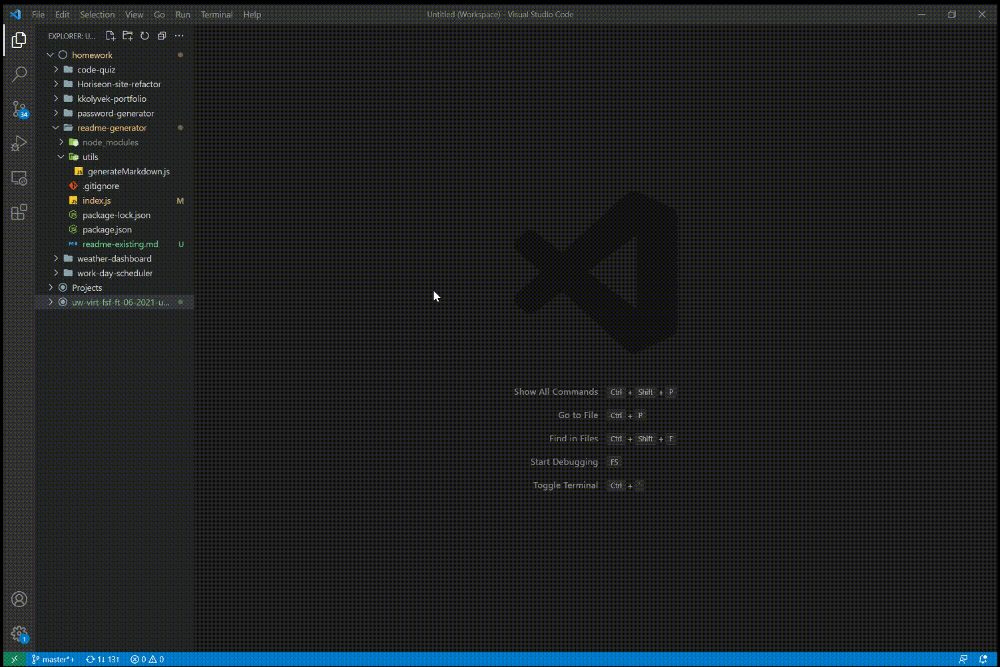

<h1 align="center"><strong>ReadMe Generator</strong></h1>

 

## Description

This tool is a JavaScript command line application that creates a readme markdown file based on some user input.

> 

## Table of Contents

1. [Installation](#installation)
2. [Usage](#usage)
3. [License](#license)
4. [Contributing](#contributing)
5. [Questions](#questions)

## Installation

This application uses [Node.js](https://nodejs.org/en/) and [NPM](https://www.npmjs.com/) - both are required.

## Usage

This readme generator is a simple command line program. Once installed and ran, the user will be prompted for several details:

- Full Name
- Project Title
- GitHub Username
- Email Address
- Whether to Include a 'Credit Given' Section
- Four Options for Open Source Software Licenses

Upon completion of the prompts, a `readme.md` file will be created in the working directory with a basic skeletal structure. The user must then fil each section out with actual content.

## License

MIT License

Copyright (c) 2021 Koppi Kolyvek

Permission is hereby granted, free of charge, to any person obtaining a copy
of this software and associated documentation files (the "Software"), to deal
in the Software without restriction, including without limitation the rights
to use, copy, modify, merge, publish, distribute, sublicense, and/or sell
copies of the Software, and to permit persons to whom the Software is
furnished to do so, subject to the following conditions:

The above copyright notice and this permission notice shall be included in all
copies or substantial portions of the Software.

THE SOFTWARE IS PROVIDED "AS IS", WITHOUT WARRANTY OF ANY KIND, EXPRESS OR
IMPLIED, INCLUDING BUT NOT LIMITED TO THE WARRANTIES OF MERCHANTABILITY,
FITNESS FOR A PARTICULAR PURPOSE AND NONINFRINGEMENT. IN NO EVENT SHALL THE
AUTHORS OR COPYRIGHT HOLDERS BE LIABLE FOR ANY CLAIM, DAMAGES OR OTHER
LIABILITY, WHETHER IN AN ACTION OF CONTRACT, TORT OR OTHERWISE, ARISING FROM,
OUT OF OR IN CONNECTION WITH THE SOFTWARE OR THE USE OR OTHER DEALINGS IN THE
SOFTWARE.

---

## Contributing

Please feel free to fork this repository if you wish to make any personal changes or build on top of what's already written.

## Questions

For further questions and comments (or bug reports), please reach out through [GitHub](https://github.com/kkolyvek) or via email at kk674@cornell.edu.

---

Yes, this readme was created using the generator!
